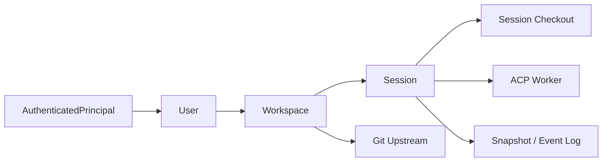
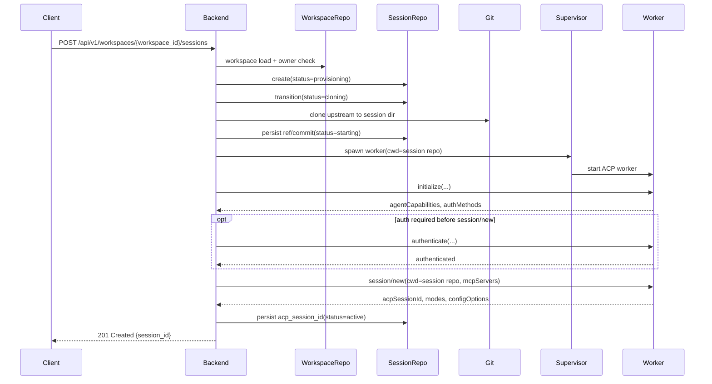

# User / Workspace / Session 階層設計

## 0. この文書の位置づけ

この文書は、`docs/explanation/acp-web-cli-architecture.md` を補う
**target design の詳細設計**です。
既存の target architecture は Web / CLI / backend の責務分離を主題にする。
ここでは `User -> Workspace -> Session` の所有構造、永続メタデータ、Git clone、
session cleanup を具体化する。

- これは **現状実装の仕様書**ではなく、今後の実装判断を揃えるための設計書である
- 既存の target architecture にある owner check、backend 主導の worker 管理、
  `SQLite + append-only event log` の方向性はそのまま継承する
- feedback-first な CLI / Web の文書は引き続き「現在の出し方」を扱う
- この文書は、それらの次の土台を定義する

## 1. 目的

この階層設計の目的は次の 4 点です。

1. 認証済み principal の下に、複数の Git upstream を持てる `Workspace` を置けるようにする
2. `Session` を `Workspace` 配下の実行単位として定義し、session 起動時に upstream を clone して
   agent を稼働させる
3. session の close と delete を分離し、明示 delete 時にはディスク領域を確実に回収する
4. Web / CLI / backend が同じ所有モデルと API を共有できるようにする

## 2. 現状との差分

現状実装とこの設計の差分は次の通りです。

| 観点 | 現状 | この設計 |
| --- | --- | --- |
| 所有モデル | `AuthenticatedPrincipal -> Session` | `AuthenticatedPrincipal -> User -> Workspace -> Session` |
| 永続化 | backend 内メモリ中心 | SQLite の durable metadata + session event log |
| Git 作業ディレクトリ | backend の現在ディレクトリ前提 | session ごとの orchestrator 管理 checkout |
| session 作成 API | `POST /api/v1/sessions` | workspace を明示した session 作成 API を追加 |
| session close | session を閉じるだけ | runtime を止め、checkout を解放し、履歴は retention で保持 |
| session delete | owner-scoped な削除 | checkout は即時解放し、UI からは hard delete、durable history は retention 後 purge |

このため、新しい階層は**現状の in-memory 実装を延長**するのではなく、
既存の target architecture にある repository / event store / supervisor の境界へ
差し込む前提で設計します。

## 3. 前提と非目標

### 3.1 前提

- `User` は、まずは既存の `AuthenticatedPrincipal` を永続化した軽量 projection とする
- この段階では **single-owner model** を採用し、workspace の共有や共同編集は扱わない
- session 起動時の Git clone は orchestrator が管理するディスク領域に対して行う
- session ID と workspace ID は識別子であって、認可トークンではない
- backend だけが ACP worker を起動・停止し、Web / CLI は HTTP + SSE だけを見る

### 3.2 非目標

- 別ユーザーへの workspace 共有
- branch / rebase / merge などの Git UI 設計
- secret manager の具体実装
- DB migration の SQL 詳細

## 4. ドメインモデル

### 4.1 関係



`User` は owner の正規形です。`Workspace` は「どの upstream を使うか」を表す durable な
設定であり、`Session` はそこから生成される live runtime です。

### 4.2 エンティティ責務

| エンティティ | 主責務 | 代表フィールド |
| --- | --- | --- |
| `User` | principal と owner record の対応付け | `user_id`, `principal_kind`, `principal_subject`, `default_workspace_id`, `created_at`, `last_seen_at` |
| `Workspace` | upstream と表示名を持つ durable な作業単位 | `workspace_id`, `owner_user_id`, `name`, `upstream_url`, `default_ref`, `credential_reference_id`, `status` |
| `Session` | 会話・worker・checkout を束ねる runtime 単位 | `session_id`, `workspace_id`, `owner_user_id`, `status`, `title`, `checkout_relpath`, `checkout_ref`, `checkout_commit_sha` |

### 4.3 不変条件

この設計では次を不変条件にします。

1. `Workspace` は必ず 1 つの `User` に属する
2. `Session` は必ず 1 つの `Workspace` に属する
3. `Session.owner_user_id` は常に親 `Workspace.owner_user_id` と一致する
4. 起動済み `Session` の checkout root は、その session だけが使う
5. `Workspace` の upstream を変更しても、既に起動済みの `Session` の checkout は変わらない
6. `Session` の internal delete pipeline は idempotent で、途中失敗しても retry 可能である
7. `Session` / `Workspace` の識別子だけでは認可されず、常に owner check を通す

### 4.4 `Workspace` と `WorkspaceFileAdapter` の関係

既存 target architecture にある `WorkspaceFileAdapter` は、
agent から見た **session checkout root** への file access 境界です。
この文書でいう `Workspace` は durable metadata であり、同じ意味ではありません。

したがって、
`WorkspaceFileAdapter` は今後も **session に束縛された checkout root** を扱い、
`Workspace` entity 自体を直接 read / write する責務は持ちません。

## 5. 永続メタデータとディレクトリ構成

### 5.1 durable と runtime の分離

| 領域 | 内容 | 保持方針 |
| --- | --- | --- |
| durable metadata | users / workspaces / sessions の主レコード | SQLite に保持 |
| durable history | transcript snapshot / canonical event log | session close 後も retention 中は保持し、delete 後も purge 完了までは restricted に保持 |
| runtime-only state | process handle, cancel handle, live SSE attach 数, lock | メモリまたは短命 lease |
| checkout disk | session ごとの Git clone | session close または delete で解放 |

### 5.2 推奨する durable records

ここでの record 名と field 名は **phase 1 実装の推奨形** です。
外部 contract そのものではなく、実装時の schema 設計指針として扱います。

- `users`
  - `user_id`, `principal_kind`, `principal_subject`
  - `default_workspace_id`, `created_at`, `last_seen_at`
- `workspaces`
  - `workspace_id`, `owner_user_id`, `name`
  - `upstream_url`, `default_ref`, `credential_reference_id`
  - `status`
  - `created_at`, `updated_at`, `deleted_at`
- `sessions`
  - `session_id`, `workspace_id`, `owner_user_id`
  - `title`, `status`, `checkout_relpath`
  - `checkout_ref`, `checkout_commit_sha`, `failure_reason`
  - `detach_deadline_at`, `restartable_deadline_at`
  - `created_at`, `last_activity_at`
  - `closed_at`, `deleted_at`

`checkout_relpath = NULL` は、「session-owned checkout が存在しない」ことを表します。
理由は次の 2 通りです。

- legacy shared CWD 由来で、最初から session-owned checkout を持たない
- workspace delete が先にディスクを回収済みである

cleanup では、この 2 つを同じ意味で扱います。

`workspace_id` は steady state では non-null にします。
ただし migration では一時的に nullable で導入し、既存 row の backfill 完了後に
non-null 制約へ切り替えます。

#### 5.2.1 dirfd-based containment

この節の要点は 3 つです。

1. DB には **絶対パスではなく相対パス** を保存する
2. path 解決は、検証済み state root の dirfd からだけ行う
3. terminal / file capability も session checkout root の dirfd に束縛する

まず、path の正本は state root です。
`credential_reference_id` は opaque な参照なので durable metadata に保存できます。
ただし、参照先の実 credential は DB / event log / 通常ログへ保存しません。

state root 自体には、backend 起動時に次の検証をかけます。

- `<state-root>` を `realpath` 相当で正規化する
- absolute / canonical / non-root であることを確認する
- service user 所有であることを確認する
- phase 1 の前提として、case-sensitive な local filesystem であることを mixed-case probe で確認する

この条件を満たさない構成では backend を fail-fast します。

`checkout_relpath` を読む側は、検証済み `<state-root>` の dirfd から解決します。

- 第一案は `openat2(..., RESOLVE_BENEATH | RESOLVE_NO_SYMLINKS)` を使う
- 同等実装を採る場合は、component-wise `openat(..., O_NOFOLLOW)` で 1 component ずつ解決する
- `/` から string-based canonicalize をやり直す実装は許可しない
- 解決に失敗した session は scrubbed error を残して `failed` へ進める
- checkout 作成 / cleanup / janitor も同じ dirfd-based rule で辿る
- validated path string を別の open で開き直さない

session tree は state root と同じ local filesystem device 内に作ります。
checkout 作成時は `fstat` で得た `st_dev` が state-root fd の `st_dev` と一致することも確認します。
一致しない場合、その session は `failed` へ進めます。

`WorkspaceFileAdapter` と terminal の working directory は、当該 session checkout root の dirfd に束縛します。
state-root 配下であっても cross-session path への到達は拒否します。

terminal subprocess は kernel-enforced filesystem sandbox に入れます。
候補は Landlock や mount namespace です。
この sandbox では次を守ります。

- state-root の DB / events / 他 session checkout へは syscall レベルで到達できないようにする
- approved binary set だけを execute 可能にする
- raw system `git` は PATH に載せず、絶対 path でも実行できないようにする
- approved binary set から `ln`、`install`、`git-lfs` などを除外する
- hardlink や Git extension 実行に使える tool は含めない
- checkout root 配下の任意 depth で、先頭 4 文字が `.git` の entry と `.git/` 配下への write を禁止する
- regular file / directory 以外の生成を許可しない

この write 禁止は direct file operation に対するものです。
6.3 の shim が許可した Git subcommand による repo 内部更新までは妨げません。

### 5.3 推奨するディレクトリ構成

```text
<state-root>/
  db.sqlite
  events/
    <session-id>.jsonl
  users/
    <user-id>/
      workspaces/
        <workspace-id>/
          sessions/
            <session-id>/
              repo/
              runtime/
```

この配置なら `User -> Workspace -> Session` の論理階層がそのままディスクにも現れます。
`repo/` と `runtime/` は runtime 専用で、close / delete 時に消してよい領域です。
一方、canonical event log は `events/` のような retention 管理下の別領域へ置き、
close 後も保持できるようにします。
ここでの canonical store は `EventStore` が管理する `events/<session-id>.jsonl` 側です。
SQLite には session metadata と snapshot / index を置けますが、per-event の正本を二重管理しません。

### 5.4 clone 戦略

初期段階では **workspace ごとの共有 object store を持たず、session ごとに直接 clone**
する設計を第一案にします。

- 利点: 単純で壊れにくく、cleanup の責務が明確
- 欠点: 同じ upstream からの繰り返し clone は遅い

後から clone コストが問題になった場合のみ、
`Workspace` 配下に bare mirror を持つ最適化を追加します。
ただしこの最適化は、`Session` が独立 checkout を持つという意味論を変えません。

## 6. ライフサイクル

### 6.1 状態

| 対象 | 状態 |
| --- | --- |
| `Workspace` | `active`, `deleting`, `deleted` |
| `Session` | `provisioning`, `cloning`, `starting`, `active`, `detached`, `restartable`, `closing`, `closed`, `deleting`, `deleted`, `failed` |

この表は **backend 側の durable lifecycle** を表します。既存 target architecture にある
`FrontendSession` の状態とは粒度が違うため、次の対応で扱います。

| この文書の状態 | parent architecture 上の見え方 |
| --- | --- |
| `provisioning`, `cloning`, `starting` | `Creating` |
| `active` | `Ready`, `Streaming`, `Busy`, `Canceling` の backend 側前提 |
| `detached` | `Detached` |
| `restartable` | `Restartable` |
| `closing` | `Closing` |
| `closed` | `Closed` |
| `failed` | `Failed` |
| `deleting`, `deleted` | user-facing state ではなく、管理系 cleanup 状態 |

ここでいう `active` は durable には「worker が生きて attach 可能」という意味です。
parent architecture ではそれを `Ready` / `Streaming` / `Busy` / `Canceling` に分けて投影します。
`detached` から再接続した場合は durable には `active` へ戻り、user-facing には `Streaming`
へ再投影されます。

### 6.2 workspace 作成

workspace 作成は次の順で進めます。

1. request の principal を `User` に解決する
2. `upstream_url`、managed credential reference (`credential_reference_id`)、owner ごとの上限制約を検証する
3. `Workspace` row を `active` で永続化する
4. clone はまだ行わない

この時点の `Workspace` は durable metadata であり、live runtime は持ちません。
phase 1 では `upstream_url` は `https` だけを受け付けます。
public repository では `credential_reference_id` は不要です。
private repository では orchestrator 管理の `credential_reference_id` を必須にします。
この `credential_reference_id` は owner-scoped な参照とし、workspace create 時に
request principal がその参照を使う権限を持つことを検証します。
`upstream_url` は少なくとも host policy を満たす必要があり、credential 埋め込み URL は reject します。

### 6.2.1 workspace delete

workspace delete は 5 段階で進めます。

1. default workspace binding を外す
2. active session の blocker を確認する
3. `Workspace` を `deleting` にする
4. disk cleanup の owner を workspace cleaner に切り替える
5. metadata と binding を掃除して `deleted` にする

各段階の意味は次の通りです。

- step 1
  - owner 単位 transaction と workspace-level lock で対象を読む
  - `users.default_workspace_id` が対象を指す場合は clear する
  - delete に伴う自動再束縛は行わない
- step 2
  - 同じ transaction の中で blocker を判定する
  - `closed` / `deleting` / `deleted` 以外の session が残る間は `409 workspace_has_active_sessions` を返す
- step 3
  - blocker が無ければ `Workspace` を `deleting` にする
  - この時点以後の create / restart は `409 workspace_deleting` で拒否する
- step 4
  - child ごとの session-level lock 下で `checkout_relpath` を `NULL` に tombstone する
  - 以後の disk cleanup は workspace cleaner だけが担当する
  - workspace directory tree 全体の recursive cleanup は lock の外で行う
- step 5
  - workspace metadata と workspace-level binding を掃除する
- 最後は `deleted` とする

補足ルールも明示しておきます。

- ここで掃除するのは workspace metadata と binding であり、credential secret 自体ではない
- step 4 の `checkout_relpath = NULL` は正本シグナルである
  - 意味は「workspace cleaner が disk cleanup を引き取った」である
- session delete / close / janitor は disk 操作前にこの値を読み直し、`NULL` または `ENOENT` を成功として扱う
- workspace-level lock は step 3 完了後に解放する
- janitor が `deleting` workspace を再開する時は step 4 から継続する
- `deleting` のまま止まった workspace は janitor が backoff 付きで retry する
- bounded retry budget を超えた場合も `deleted` へは進めない
- その場合は scrubbed failure を記録し、operator alert を出したうえで `deleting` のまま明示介入を待つ

### 6.3 session 起動



起動時の要点は次の通りです。

- `Session` はまず `provisioning` で row を作る
- checkout を張る直前に `cloning` を記録し、upstream の具体的な ref / commit を確定する
- worker 起動前に `checkout_commit_sha` を記録し、後から再現可能にする
- worker は **session checkout root を cwd** にして起動する
- worker 起動後は `initialize`、必要なら `authenticate`、その後に `session/new` を行う
- `session/new` の `cwd` に session checkout root を渡し、その応答で返る `acpSessionId` を保存する
- create response は `201 {session_id}` とし、初回 snapshot は後続の SSE attach / snapshot fetch で受け取る
- 起動失敗時は `failed` に遷移し、半端な checkout は cleanup 対象にする
- clone / fetch / push には wall-clock timeout を設ける
- 転送量 / checkout size / workspace / user ごとの disk budget 上限を設ける
- 上限超過時は cleanup へ進める

clone 実行時の trust boundary は、以下の 5 つに分けて考えます。

#### 6.3.1 Git 実行の基本環境

- clone 先は orchestrator 管理ディレクトリに固定する
- clone / fetch / push 実行時は `GIT_TERMINAL_PROMPT=0` を基本にする
- 引き継ぐ環境変数は、`PATH`、orchestrator 管理の非 writable な空 `HOME`、`LANG`、`TMPDIR`、
  明示注入した `GIT_CONFIG_*` など必要最小限の closed allowlist だけにする
- それ以外の `GIT_*` / `SSH_*` / `XDG_CONFIG_HOME` / proxy / loader / editor /
  TLS override 系の環境変数は渡さない
- global / system gitconfig 由来の credential helper は無効化し、明示許可した設定だけを使う
- checkout manager と push wrapper の Git 実行は、file-based overlay ではなく
  `git -c ...` による process-level allowlist override で起動する

#### 6.3.2 orchestrator 管理の `git` shim

- terminal capability には raw system `git` を露出しない
- closed env allowlist と `-c` 群、`--git-dir=<checkout_root>/.git`、
  `--work-tree=<checkout_root>` を再注入する orchestrator 管理の `git` shim だけを PATH に載せる
- shim は shell から環境を引き継がず、毎回 fresh env を closed allowlist から組み立てる
- invocation ごとに `GIT_CONFIG_COUNT` / `GIT_CONFIG_KEY_*` / `GIT_CONFIG_VALUE_*` /
  `GIT_CONFIG_PARAMETERS`、`GIT_EXEC_PATH`、`GIT_DIR`、`GIT_WORK_TREE`、
  `GIT_ASKPASS`、loader 系環境変数を除去する
- user 指定 `-c` は拒否する
- phase 1 では shim を subcommand allowlist mode で動かす
- 許可するのは `status`、`diff`、`log`、`show`、`add`、`commit`、read-only な `branch`、
  `checkout`、`switch`、`merge`、`rebase`、`reset`、`restore`、`stash`、`blame`、`grep`、
  `fetch`、`pull` だけにする
- `config` の write form、`remote`、`credential`、`clone`、`submodule`、`worktree`、`push` は拒否する
- `fetch` / `pull` は bare な pre-configured remote 名だけを受け付け、positional URL / refspec 引数は拒否する
- `--exec`、`--recurse-submodules`、`-O` / `--open-files-in-pager`、`--upload-pack`、
  `--receive-pack`、`--ext-diff`、`--config-env`、`--git-dir`、`--work-tree`、`-C`、
  `--exec-path`、`--super-prefix` などの危険な global flag / option も拒否する
- shim 実行直前にも `.git/config`、repository tree 配下の全 `.gitattributes`、
  `.git/info/attributes` を closed allowlist で再検証する
- phase 1 の safe list は空とし、`filter=`、`diff=`、`merge=`、`textconv` の
  driver 参照が 1 つでもあれば fail closed する
- `GIT_CONFIG_COUNT` は補助用途に留め、trust boundary としては使わない
- 少なくとも `GIT_CONFIG_NOSYSTEM=1`、`GIT_CONFIG_GLOBAL=/dev/null`、
  `core.hooksPath=/dev/null`、`core.fsmonitor=false`、`protocol.allow=never`、
  `protocol.https.allow=always`、`protocol.git.allow=never`、`protocol.ssh.allow=never`、
  `protocol.file.allow=never`、`protocol.ext.allow=never`、`credential.helper=`、
  `core.sshCommand=`、`core.attributesFile=/dev/null`、`http.followRedirects=false`、
  `transfer.bundleURI=false`、`submodule.recurse=false`、`commit.gpgSign=false`、
  `tag.gpgSign=false`、`diff.submodule=false`、`status.submoduleSummary=false` を強制する

#### 6.3.3 repo-controlled 設定と network egress の制限

- phase 1 では checkout manager / worker / terminal capability の Git 実行を同じ service uid で揃える
- `safe.directory=*` は使わない
- 将来 split-uid にする場合も wildcard ではなく対象 checkout path だけを許可する
- phase 1 では repo-controlled な Git execution path を許可しない
- 代表例は `include.*`、filter / smudge / clean driver、`diff.*.command` / `textconv`、
  `merge.*.driver`、repo-local credential helper、`diff.external`、`core.gitProxy`、
  `url.*.insteadOf` / `pushInsteadOf`、`http.proxy` / `http.<url>.proxy`、
  `http.sslCAInfo`、`http.sslCAPath`、`http.sslVerify`、`remote.*.promisor`、`alias.*`、
  `core.editor`、`core.pager`、`pager.*`、`sequence.editor`、`gpg.program`、
  `gpg.*.program` である
- clone / start / restart のたびに `.git/config` と attribute 設定を closed allowlist で検証する
- allowlist 外の key や危険な execution path が見つかったら fail closed する
- checkout manager / fetch / push など orchestrator 側の Git 実行直前にも同じ検証を再実行する
- `-c` による process-level override を primary trust boundary とし、file scan は defense-in-depth とする
- upstream の到達先は任意に広げず、少なくとも allowlist または admin-configured egress policy に従う
- phase 1 では clone / fetch / push の redirect follow を無効化する
- 初回 redirect を要求する provider は phase 1 の対象外とし、workspace create preflight で reject する
- clone / fetch のたびに hostname を再解決し、resolved IP が deny/allow policy を満たすことを再確認する
- 検証は preflight だけで終わらせず、実際の接続も validated address に pin するか、
  network-layer egress policy で同じ制約を強制する
- Git が secondary fetch を起こしうる機能（bundle URI, submodule, alternates など）は phase 1 では無効化する

#### 6.3.4 credential と push の扱い

- orchestrator 管理外の ambient credential に依存しない
- private repository では `credential_reference_id` を orchestrator 管理の HTTPS credential helper へ解決する
- session 内の clone / fetch には provider 側で write 不可な read-only credential を使う
- read-only credential を分離発行できない provider は phase 1 の private workspace に使わない
- push は generic helper から直接は許可しない
- session owner が承認した時だけ、orchestrator 自身が target refspec と validated remote URL を検証する
- そのうえで `remote.origin.url=<validated_url>` と空の `remote.origin.pushurl` を明示指定した
  push wrapper を、その単一 invocation にだけ実行する
- refspec 制限の正本は parent architecture の 11.3 に従う
- credential lease は短命にする
- 少なくとも push 前と、lease expiry 後の fetch 前には `credential_reference_id` を再解決する
- `detached` 中は lease を再解決せず、延長もしない
- credential が必要な Git 操作は fail closed する

#### 6.3.5 file / terminal capability との整合

- file / terminal capability は 5.2.1 の containment と write-deny rule に従う
- deny 判定と実際の write は同じ open file handle に対して行う
- 検証済み path string を後で開き直す実装は許可しない

### 6.4 session close と TTL cleanup

`close` は「会話を終了して read-only にする」操作です。
delete と違い、session metadata と transcript は retention window 中に残します。

状態別の扱いは次の通りです。

- `restartable` からの明示 close も同じ close path を使う
  - live worker が無いため、worker stop はスキップする
  - final snapshot / cleanup 確認から `closed` へ進める
- `Busy` / `Canceling` 中の close request は、cancel / drain と final snapshot 確定の後に `closing` へ進める
- `Canceling` 中に close を受けた場合は `pending_close` intent を durable に残し、crash recovery 後も再適用する
- `provisioning` / `cloning` / `starting` 中の close request は `409 session_not_closable` を返す
  - abort が必要な場合は delete を使う

明示 close だけでなく、最後の client が切断された後の TTL expiry も同じ shutdown path に合流させます。

1. 最後の client が外れたら `detached` へ遷移し、TTL timer を開始する
2. TTL 中に再接続があれば `active` へ戻す
3. 明示 close か TTL expiry のどちらかで `closing` へ進む
4. 既存の credential lease を revoke し、helper 側でも新規使用を拒否する。
   revoke 失敗時は pending revocation を記録し、janitor が再試行する
5. worker を graceful stop し、final snapshot / event log を durable store へ確定する
6. `repo/` と `runtime/` を削除して runtime ディスクを解放する
7. `Session` を `closed` にし、read-only 参照だけ許可する

補足も 2 点あります。

- `closed` への status 遷移は、final snapshot / event log の確定後にだけ行う
- retention の対象は **履歴とメタデータ** であり、`repo/` や `runtime/` を残すことではない

通常の session close は `checkout_relpath` を `NULL` にしません。
`checkout_relpath = NULL` は workspace delete や migration で使う coordination marker です。
close 後の cleanup 済み判定は、`ENOENT` を含む実ディスク状態で行います。

### 6.5 session delete

`delete` は、少なくとも end-user view からは hard delete として見える必要があります。
ただし既存 target architecture の retention 要件に合わせ、operator 側の purge は二段階にします。

状態別の扱いは次の通りです。

- `closing` 中に delete が到着した場合
  - 進行中の close を引き継ぐ
  - worker stop / final snapshot / checkout cleanup はやり直さない
  - そのうえで owner-facing API からの不可視化と purge を `deleting` で続ける
- `busy` / `canceling` 中に delete が到着した場合
  - まず cancel / drain を要求する
  - close 相当の final snapshot を確定させた後に `deleting` へ進める
  - graceful path が timeout した時だけ強制停止へフォールバックする
- `provisioning` / `cloning` / `starting` 中に delete が到着した場合
  - in-flight clone や worker spawn を abort する
  - final snapshot は作らずに `deleting` cleanup へ進める

1. `deleting` へ遷移する
2. 既存の credential lease を revoke し、helper 側でも新規使用を拒否する。
   revoke 失敗時は pending revocation を記録し、janitor が再試行する
3. worker が残っていれば停止する
4. `repo/` と `runtime/` が残っていれば再度削除する
5. owner-facing API からは即時に不可視化し、`GET /sessions/{id}` や `/events` は `404` にする
6. final snapshot / event log は restricted purge queue または sealed archive へ移し、retention expiry 後に物理削除する
7. purge 完了後に session metadata を完全削除する

delete は idempotent にし、途中失敗時は janitor が再実行できるようにします。
session delete は disk 操作前に `checkout_relpath` を session lock 下で読み直します。
`NULL` なら cleanup 済みとして skip します。
workspace delete など別経路が先に消していた場合も、`ENOENT` は成功として扱います。

### 6.6 crash recovery と janitor

backend 再起動時には durable state とディスク状態を照合します。
見る点は 4 つです。

1. interrupted turn をどう seal するか
2. どの session を `restartable` に戻せるか
3. どの session を `failed` / `closing` / `deleting` に送るか
4. janitor がどこから cleanup を再開するか

#### 6.6.1 interrupted turn の封止

- durable metadata は、`active` の中でも mid-turn を識別できるように `in_flight_turn_id` 相当の情報を保持する
- crash recovery は `active -> restartable` の前に、その turn を `interrupted` として event store へ seal する
- `Busy` と `Canceling` の投影は、この reconciliation を経由してから `restartable` / `closing` / `deleting` へ分岐する
- `pending_close` が立っている session は `restartable` へ戻さず、`closing` を優先する

#### 6.6.2 `restartable` に戻せる条件

- `active` または `detached` なのに worker がいない session は、checkout と history が整合していれば
  親 workspace が `active` の時だけ `restartable` へ補正する
- `workspace_id IS NULL` の coexistence session は workspace 依存の recovery に入れず、10 の migration rule に従う
- `restartable` へ補正する時点で、その session に紐づく credential lease は revoke する
- revoke に失敗した場合は pending revocation を記録し、restart 前に再試行する
- 親 workspace が `deleting` / `deleted` の場合は `restartable` へ戻さず、`closing` または `deleting` 側へ進める
- `restartable` session は read-only snapshot を返しつつ、`POST /api/v1/sessions/{session_id}/restart` を受け付ける

#### 6.6.3 `failed` / `closing` / `deleting` へ送る条件

- `starting` で crash した session でも、`checkout_commit_sha` と intact checkout が残っている場合は
  restart 途中とみなし、workspace が `active` なら `restartable` へ戻す
- `starting` で intact checkout が無い場合は、未完了 restart / startup とみなして `failed` へ進める
- `provisioning` / `cloning` は未完了起動として扱い、partial checkout を掃除したうえで `failed` へ進める
- `active` / `detached` でも checkout や history が壊れていれば `restartable` ではなく `failed` へ進める
- `restartable` でも checkout root `ENOENT`、`st_dev` mismatch、connectivity check failure のような
  deterministic な破損が見つかった場合は `failed` へ進める
- `failed` 直後の cleanup は best-effort であり、partial checkout が残ることはある
- `closing` は final snapshot の有無と checkout cleanup の進捗を見て再開する
- worker 停止済みなら cleanup をやり切って `closed` へ進める

#### 6.6.4 deadline と janitor の責務

- `restartable` へ入る時は `restartable_deadline_at = now + restart_ttl` を設定する
- restart 失敗や `starting -> restartable` への戻りでは `restartable_deadline_at` を延長せず、そのまま維持する
- owner が deadline 後半で restart を再試行し、依存サービス側の一時障害で失敗した場合は、
  bounded grace を 1 回だけ付与できる
- restart 成功時は `restartable_deadline_at` を clear する
- 期限切れの `restartable` session は janitor が `closing` へ進め、checkout cleanup と retention path へ合流させる
- `detached` で worker が still live かつ親 workspace が `active` の場合だけ、
  `detach_deadline_at` を見て TTL を再計算する
- 期限内なら timer を再開し、期限超過なら close path へ進める
- 親 workspace が `deleting` / `deleted` の `restartable` session は、TTL を待たずに janitor が `closing` へ進める
- janitor の state transition も通常の session mutation と同じ session-level lock に参加させる
- workspace status に依存する分岐では workspace-level lock -> session-level lock の順で取る
- `deleting` workspace 配下の session に対する janitor の best-effort cleanup は
  disk 操作をせず、workspace cleaner へ委譲する
- `failed` は terminal ではなく、janitor が既定では `closing` へ進めて cleanup を完了させる
- 親 workspace が `deleting` / `deleted` の `failed` session だけは `deleting` へ進める
- owner は `failed` session に対しても `DELETE /api/v1/sessions/{session_id}` を実行できる
- その場合は janitor を待たずに `deleting` へ進められる
- row が無いのに session dir だけ残る orphan は janitor が削除する
- `deleting` のまま止まっていた session は cleanup を再試行する
- `failed` session の partial clone も janitor が消せるようにする
- retention expiry を過ぎた `closed` session は janitor が `deleting` へ進め、通常の purge pipeline で片付ける

### 6.7 session restart

restart の durable path は `restartable -> starting -> active`、または
`restartable -> starting -> restartable` です。
fresh create と違って `provisioning` / `cloning` は通りません。

restart request の前提条件は次の通りです。

- 親 workspace が `active` である
- 既存 checkout を再利用できる
- workspace の `credential_reference_id` がまだ有効で、owner に許可されている
- intact checkout の最低条件を満たす
  - `.git/HEAD` が `checkout_commit_sha` へ解決できる
  - 対象 commit object が存在し、軽量な connectivity check を通る
  - checkout root の `st_dev` が state-root fd と一致する

restart 前には、clone / start と同じ hardening をやり直します。

- `.git/config` / attribute 設定を再検証する
- `include.*`、custom filter / diff / merge driver、repo-local credential helper などが見つかったら fail closed する
- worktree `.gitattributes` と `.git/info/attributes` も scan し、phase 1 の safe list 外 driver 参照があれば fail closed する
- workspace metadata 由来の安全な remote URL と process-level allowlist を再注入し、
  repo-controlled execution path を再び無効化する

実行順序は次の通りです。

1. credential を再検証する
2. checkout を re-harden する
3. worker を起動する
4. `initialize` を行う
5. Agent が `loadSession` を持つなら同じ ACP session を復元する
6. `loadSession` を持たないなら transcript と metadata を保持したまま、新しい ACP session を
   同じ frontend session に再束縛する

restart fallback は親 workspace がまだ `active` の時にだけ `restartable` へ戻します。
そうでなければ `closing` または `deleting` 側へ進めます。
credential 再検証や worker 起動が失敗した場合、その試行で取得した credential lease は revoke します。
session は `restartable` のまま残し、restart request だけを失敗として返します。

## 7. API とクライアント導線

### 7.1 hierarchy 導入で追加または意味変更する API

完全な route 一覧は parent architecture の 8.3 を正本とします。
ここでは hierarchy 導入で新規追加された route と、意味が変わる route だけを扱います。

| Method | Path | 用途 | 認可 |
| --- | --- | --- | --- |
| `GET` | `/api/v1/sessions` | owner-wide の recent session 一覧 | 認証済み principal |
| `POST` | `/api/v1/sessions` | compatibility な session 作成（default workspace へ委譲） | 認証済み principal |
| `GET` | `/api/v1/workspaces` | owned workspace 一覧 | 認証済み principal |
| `POST` | `/api/v1/workspaces` | workspace 作成 | 認証済み principal |
| `PUT` | `/api/v1/users/me/default-workspace` | default workspace を明示設定 | 認証済み principal |
| `GET` | `/api/v1/workspaces/{workspace_id}` | workspace 詳細 | workspace owner |
| `PATCH` | `/api/v1/workspaces/{workspace_id}` | workspace rename / default ref 更新 | workspace owner |
| `DELETE` | `/api/v1/workspaces/{workspace_id}` | workspace 削除 | workspace owner |
| `GET` | `/api/v1/workspaces/{workspace_id}/sessions` | workspace 配下 session 一覧 | workspace owner |
| `POST` | `/api/v1/workspaces/{workspace_id}/sessions` | session 起動 | workspace owner |
| `POST` | `/api/v1/sessions/{session_id}/restart` | restartable session の再開 | session owner |

`GET /api/v1/sessions` は owner 全体の recent session を返す。
各 item には `workspace_id` と、必要なら `workspace_name` を含める。
compatibility `POST /api/v1/sessions`、workspace delete blocker、immutable field の正本は
parent architecture の 8.3 です。
default workspace binding と race 制御の正本も同じく 8.3 です。
compatibility create の default binding 解決は、
`PUT /api/v1/users/me/default-workspace` や workspace delete step 1 と同じ
owner transaction で直列化します。
session row 作成も同じ owner transaction に含めます。
この文書で追加する API 契約は次の 4 点です。

1. `PATCH /api/v1/workspaces/{workspace_id}` に `upstream_url` または `credential_reference_id` を含めた場合は
   `409 workspace_immutable_field` を返す
2. `PUT /api/v1/users/me/default-workspace` は owner の **`active` workspace** にだけ束縛できる。
   binding が未設定の間、compatibility `POST /api/v1/sessions` は `409 workspace_required` を返す
3. `POST /api/v1/sessions/{session_id}/restart` は `restartable` にだけ有効で、それ以外は
   `409 session_not_restartable` を返す
4. `restartable`、`failed`、または長時間 `closing` の session が workspace delete を止める場合がある。
   owner は明示 close または `DELETE /api/v1/sessions/{session_id}` で unblock できる

### 7.2 維持する session-scoped API

完全な route 一覧は parent architecture の 8.3 を正本とします。
ここでは既存 client 互換のために維持する session-scoped API だけを列挙します。

session 起動後の live 操作は、既存 client の変更量を抑えるため
`session_id` ベースの path を維持します。

- `GET /api/v1/sessions/{session_id}`
- `PATCH /api/v1/sessions/{session_id}`
- `GET /api/v1/sessions/{session_id}/history`
- `GET /api/v1/sessions/{session_id}/events`
- `POST /api/v1/sessions/{session_id}/messages`
- `POST /api/v1/sessions/{session_id}/cancel`
- `POST /api/v1/sessions/{session_id}/permissions/{requestId}`
- `POST /api/v1/sessions/{session_id}/close`
- `DELETE /api/v1/sessions/{session_id}`

### 7.3 contract の変更

`acp-contracts` には少なくとも次を追加します。

- `WorkspaceSummary` / `WorkspaceDetail` のような DTO
- session 系 DTO への `workspace_id`
- session snapshot への `checkout_ref` / `checkout_commit_sha`
- session summary / snapshot の state enum への `Restartable`

### 7.4 Web / CLI の導線

- Web の `/app/` は、現在の「即 session を作る route」から
  **workspace の明示作成または選択** に寄せる
- 初回 `/app/` では default workspace を自動作成しない
- Web の canonical deep link は
  `/app/workspaces/{workspace_id}/sessions/{session_id}` を推奨する
- 既存の `/app/sessions/{session_id}` は compatibility redirect を持てる
- CLI は `chat --session <id>` を残しつつ、`workspace list/create` と
  `chat --workspace <id>` を追加する

## 8. backend 境界への差し込み方

詳細な component / port の正本は parent architecture の 8.1 と 8.2 を参照します。
この章で固定したいことは次の 3 点です。

1. `Workspace` は durable metadata として分離する
2. `Session` は runtime 単位として扱う
3. `WorkspaceFileAdapter` は session checkout root の file boundary に専念させる

特に session create / restart では、次の port を組み合わせます。

- `WorkspaceStorePort`
- `WorkspaceCheckoutPort`
- `SessionStateStorePort`
- `WorkerLifecyclePort`

workspace 所有情報の解決、checkout materialization、runtime metadata 保存、worker 制御は混ぜません。

直列化の対象も明示しておきます。

- 7.1 で述べた create / restart / delete
- detach
- close
- TTL expiry
- reconnect
- worker crash recovery
- workspace delete の blocker 判定

lock 順序は **owner-level serialization -> workspace-level lock -> session-level lock** に固定します。
session lock を保持したまま workspace lock を取りに行く実装は許可しません。

owner-level serialization は `users` row や default binding を触る操作にだけ使います。
代表例は compatibility create、`PUT /api/v1/users/me/default-workspace`、workspace delete step 1 です。

session create / restart と workspace delete blocker 判定は、workspace 状態の読取りと
session row の insert / transition を同じ owner transaction で行います。
これにより、`deleting` 済み workspace への新規 session 生成 race を防げます。

長時間の clone / cleanup は lock の外で二相に進めます。
最初の transaction で `cloning` / `deleting` などの中間状態だけを確定し、
完了時に必要最小限の lock を取り直して結果を永続化します。
これは共有 DB transaction または application-level lock のどちらかで跨ぎ port に実装します。

## 9. セキュリティと ownership

この節は parent architecture の 11.3 から 11.5 を前提にしつつ、
workspace hierarchy で追加される制約だけを補います。

1. 全 workspace / session route で principal ベースの owner check を行う
2. session ID / workspace ID を認可トークン代わりに使わない
3. DB / event log / 通常ログに auth token、cookie、secret path、Git credential を保存しない
4. phase 1 の `upstream_url` は `https` だけを許可する。public repository では
   `credential_reference_id` なしでよい。private repository では orchestrator 管理の
   credential reference を必須にする。その他すべての scheme は reject し、
   `file://`、local path、loopback / link-local / RFC1918 / ULA / そのほか
   non-globally-routable 宛は明示的に拒否する
5. session checkout dir は orchestrator 管理下の private path に固定する
6. file / terminal capability は 5.2.1 の dirfd-based containment に従う。
   session checkout root の外へは出ず、先頭 4 文字が `.git` の entry と `.git/` 配下への write は許可しない。
   regular file / directory 以外の生成も許可しない
7. clone / fetch / push は sanitized environment と明示的 credential source で実行し、ambient credential を使わない
8. push policy の正本は parent architecture の 11.3 とし、この文書では 6.3 の
   orchestrator 実行 push wrapper だけを hierarchy 固有の追加仕様として扱う
9. push の許可 / 拒否 / 実行結果は、secret を含めずに session / workspace / target ref 単位で audit する

この節で補足したい点は次の通りです。

- `upstream_url` に credential が埋め込まれている場合は redact ではなく reject し、
  別の credential reference 経路で扱う
- phase 1 では private HTTPS repository 用に orchestrator 管理の `credential_reference_id` を受け付ける
- この参照は clone / fetch の read source に使い、provider 側でも write 不可な scope を必須にする
- read-only credential を発行できない provider は phase 1 の対象外とする
- push の policy と lease rule の正本は parent architecture の 11.3 とし、
  この文書では 6.3 の push wrapper 実装 detail だけを補う
- host / redirect / secondary fetch / gitconfig / hook / ambient credential の hardening は
  6.3 の trust boundary に従う
- Git stderr や credential 解決 error は、そのまま `failure_reason` や SSE error に流さない
- secret を scrub した message だけを保存または返す
- credential は URL や環境変数ではなく、stdin-based credential helper から Git へ渡す
- `ssh` upstream は将来拡張候補として残すが、phase 1 の対象外とする

## 10. 段階的な移行

いきなり全 client を切り替えず、次の段階で進めるのが安全です。

1. `User` / `Workspace` / `Session` durable metadata を追加し、principal から `User` を lazily 作る
   - 既存 principal は `User` row へ materialize し、後続 backfill の `owner_user_id` 正本を先に作る
2. `POST /api/v1/sessions` を切り替える前に、既存 owner ごとに default workspace の bootstrap / backfill を行う
   - 単一 upstream を前提にできる環境では operator-configured bootstrap upstream から default workspace を作る
   - それができない環境では compatibility path を有効化せず、workspace-aware client を先に出す
3. owner-wide `GET /api/v1/sessions` と compatibility `POST /api/v1/sessions` を default workspace 経由で維持する
    - binding 未設定時の扱い
      - bootstrap 前、または default binding を clear した直後の呼び出しは
        `409 workspace_required` で `PUT /api/v1/users/me/default-workspace` へ誘導する
    - backfill の進め方
      - backfill 時に `users.default_workspace_id` を埋め、互換 create の宛先を一意にする
      - 既存 session row がある場合は、その owner の `owner_user_id` と `default_workspace_id` を使って
        `owner_user_id` / `workspace_id` を backfill してから non-null 制約へ進む
      - legacy shared CWD を使っていた session は `checkout_relpath = NULL` とし、
        close / delete cleanup では session-owned checkout が無いものとして扱う
      - backfilled session は step 5 まで旧 checkout path を保持してよい
      - cleanup / recovery は `workspace_id` から path を再計算せず、`checkout_relpath` の正本を見る
    - coexistence 中の扱い
      - `workspace_id IS NULL` の session は workspace 依存の recovery 分岐へ入れない
      - `active` / `detached` なら `closing` へ進める
      - それ以外は現状 state のまま、backfill 完了または明示 close / delete を待つ
      - backfilled session の既存 `remote.origin.url` が割り当てた workspace の `upstream_url` と一致しない場合、
        その session は restart 不可とし、`closed` または `failed` のまま扱う
    - 制約有効化の条件
      - backfill と non-null 制約の有効化は別段階にする
      - `workspace_id IS NULL` の row が 0 件であることを確認してから制約を有効化する
      - coexistence 期間でも、新規 session row は `workspace_id` null を許可しない
      - NULL row 確認と制約有効化は SQLite の single-writer lock、または同等の migration lock の下で行う
    - rollout gate
      - この切替は workspace bootstrap 完了後に feature flag または同等の rollout gate で有効化する
      - step 2 の workspace bootstrap は create-if-not-exists で idempotent にする
      - step 3 は missing workspace を検出した時点で失敗として止める
4. workspace API と contract を追加し、session DTO に `workspace_id` を載せる
5. session 起動を workspace 配下へ移し、checkout root を session 固有 path に切り替える
    - 新規 session だけ新レイアウトを使う
    - 既存 active / backfilled session は close / delete まで旧 `checkout_relpath` を維持する
    - janitor と cleanup は coexistence 中に旧 root / 新 root の両方を走査する
    - legacy shared CWD 自体は session-owned cleanup の対象外とする
    - janitor orphan scan からも除外し、operator-managed path として扱う
6. Web の `/app/` を workspace bootstrap へ、CLI に workspace command を追加する
7. clone コストが問題になった時だけ mirror cache を検討する

### 10.1 rollback posture

- step 1 から step 3 は retryable / idempotent な migration とし、feature flag を落とせば新挙動を止められる
- step 4 と step 5 は forward-compatible に進める
- 旧 session は旧 path を維持することで、rollback 時も読めるようにする
- step 6 以降は user-facing cutover なので、rollback は schema を戻すのではなく feature flag で導線を戻す

既存の session-by-id API を残すことで、attach / stream / message の client 変更は最小化できます。

## 11. 主要な設計判断

| 論点 | 推奨判断 | 理由 |
| --- | --- | --- |
| `User` の定義 | `AuthenticatedPrincipal` の durable projection | 別 user service を増やさず、既存 auth transport を活かせる |
| clone 戦略 | session ごとの direct clone | 単純で cleanup と障害時の切り分けが容易 |
| API 形状 | workspace で create/list、session は by-id live ops 維持 | client churn を抑えつつ hierarchy を導入できる |
| close と delete | close は履歴保持 + checkout 解放、delete は UI から即時削除しつつ retention 後 purge | retention と disk reclaim を両立できる |

## 12. phase 1 の確定事項と残課題

### 12.1 phase 1 で確定した事項

1. Web の初回 `/app/` は default workspace を自動作成せず、workspace の明示作成または選択を求める
2. phase 1 の upstream transport は `https` だけを扱い、private repository は orchestrator 管理の
   `credential_reference_id` で clone / fetch / push を許可する
3. backend 再起動後に live worker を失った session は、`closed` や `failed` へ落とさず
   `restartable` として扱う

### 12.2 残課題

1. session 起動時に default branch HEAD だけでなく pinned ref を許可するか
    - ここでいう pinned ref は、workspace の `default_ref` とは別に session create request ごとに渡す
      checkout 対象である
    - 候補は branch 名、tag、commit SHA、あるいは `refs/heads/*` / `refs/tags/*` のような完全修飾 ref である
    - たとえば同じ workspace から `main` ではなく `release/v1.2.3` や特定 commit に固定した session を
      起動できるようにする論点である
2. 外部で credential が revoke / rotate された時に、既発行 lease をどう即時失効させるか
   - phase 1 では短命 lease と close / delete 時 revoke で抑える
   - 将来は `credential_reference_id` 単位の force revoke 経路を持つ余地がある

残課題はあります。
ただし、`User -> Workspace -> Session` の責務、所有境界、clone / cleanup の基本方針は
この文書で固定できます。
