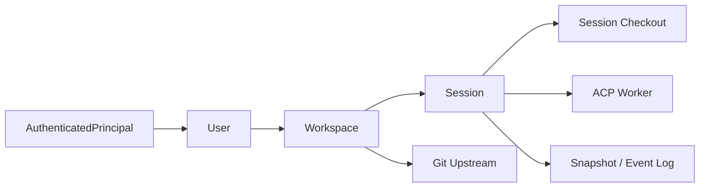
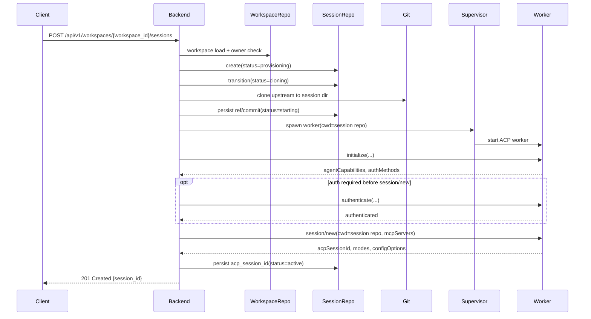

# User / Workspace / Session 階層設計

## 0. この文書の位置づけ

この文書は、`docs/explanation/acp-web-cli-architecture.md` を補う
**target design の詳細設計**である。
既存の target architecture は Web / CLI / backend の責務分離を主題にする。
ここでは `User -> Workspace -> Session` の所有構造、永続メタデータ、Git clone、
session cleanup を具体化する。

- これは **現状実装の仕様書**ではなく、今後の実装判断を揃えるための設計書である
- 既存の target architecture にある owner check、backend 主導の worker 管理、
  `SQLite + append-only event log` の方向性はそのまま継承する
- feedback-first な CLI / Web の文書は引き続き「現在の出し方」を扱う
- この文書は、それらの次の土台を定義する

## 1. 目的

この階層設計の目的は次の 4 点です。

1. 認証済み principal の下に、複数の Git upstream を持てる `Workspace` を置けるようにする
2. `Session` を `Workspace` 配下の実行単位として定義し、session 起動時に upstream を clone して
   agent を稼働させる
3. session の close と delete を分離し、明示 delete 時にはディスク領域を確実に回収する
4. Web / CLI / backend が同じ所有モデルと API を共有できるようにする

## 2. 現状との差分

現状実装とこの設計の差分は次の通りです。

| 観点 | 現状 | この設計 |
| --- | --- | --- |
| 所有モデル | `AuthenticatedPrincipal -> Session` | `AuthenticatedPrincipal -> User -> Workspace -> Session` |
| 永続化 | backend 内メモリ中心 | SQLite の durable metadata + session event log |
| Git 作業ディレクトリ | backend の現在ディレクトリ前提 | session ごとの orchestrator 管理 checkout |
| session 作成 API | `POST /api/v1/sessions` | workspace を明示した session 作成 API を追加 |
| session close | session を閉じるだけ | runtime を止め、checkout を解放し、履歴は retention で保持 |
| session delete | owner-scoped な削除 | checkout は即時解放し、UI からは hard delete、durable history は retention 後 purge |

このため、新しい階層は**現状の in-memory 実装を延長**するのではなく、
既存の target architecture にある repository / event store / supervisor の境界へ
差し込む前提で設計します。

## 3. 前提と非目標

### 3.1 前提

- `User` は、まずは既存の `AuthenticatedPrincipal` を永続化した軽量 projection とする
- この段階では **single-owner model** を採用し、workspace の共有や共同編集は扱わない
- session 起動時の Git clone は orchestrator が管理するディスク領域に対して行う
- session ID と workspace ID は識別子であって、認可トークンではない
- backend だけが ACP worker を起動・停止し、Web / CLI は HTTP + SSE だけを見る

### 3.2 非目標

- 別ユーザーへの workspace 共有
- branch / rebase / merge などの Git UI 設計
- secret manager の具体実装
- DB migration の SQL 詳細

## 4. ドメインモデル

### 4.1 関係



`User` は owner の正規形です。`Workspace` は「どの upstream を使うか」を表す durable な
設定であり、`Session` はそこから生成される live runtime です。

### 4.2 エンティティ責務

| エンティティ | 主責務 | 代表フィールド |
| --- | --- | --- |
| `User` | principal と owner record の対応付け | `user_id`, `principal_kind`, `principal_subject`, `default_workspace_id`, `created_at`, `last_seen_at` |
| `Workspace` | upstream と表示名を持つ durable な作業単位 | `workspace_id`, `owner_user_id`, `name`, `upstream_url`, `default_ref`, `status` |
| `Session` | 会話・worker・checkout を束ねる runtime 単位 | `session_id`, `workspace_id`, `owner_user_id`, `status`, `title`, `checkout_relpath`, `checkout_ref`, `checkout_commit_sha` |

### 4.3 不変条件

この設計では次を不変条件にします。

1. `Workspace` は必ず 1 つの `User` に属する
2. `Session` は必ず 1 つの `Workspace` に属する
3. `Session.owner_user_id` は常に親 `Workspace.owner_user_id` と一致する
4. 起動済み `Session` の checkout root は、その session だけが使う
5. `Workspace` の upstream を変更しても、既に起動済みの `Session` の checkout は変わらない
6. `Session` の delete は idempotent で、途中失敗しても retry 可能である
7. `Session` / `Workspace` の識別子だけでは認可されず、常に owner check を通す

### 4.4 `Workspace` と `WorkspaceFileAdapter` の関係

既存 target architecture にある `WorkspaceFileAdapter` は、
agent から見た **session checkout root** への file access 境界です。
この文書でいう `Workspace` は durable metadata であり、同じ意味ではありません。

したがって、
`WorkspaceFileAdapter` は今後も **session に束縛された checkout root** を扱い、
`Workspace` entity 自体を直接 read / write する責務は持ちません。

## 5. 永続メタデータとディレクトリ構成

### 5.1 durable と runtime の分離

| 領域 | 内容 | 保持方針 |
| --- | --- | --- |
| durable metadata | users / workspaces / sessions の主レコード | SQLite に保持 |
| durable history | transcript snapshot / canonical event log | session close 後も retention 中は保持し、delete 後も purge 完了までは restricted に保持 |
| runtime-only state | process handle, cancel handle, live SSE attach 数, lock | メモリまたは短命 lease |
| checkout disk | session ごとの Git clone | session close または delete で解放 |

### 5.2 推奨する durable records

- `users`
  - `user_id`, `principal_kind`, `principal_subject`
  - `default_workspace_id`, `created_at`, `last_seen_at`
- `workspaces`
  - `workspace_id`, `owner_user_id`, `name`
  - `upstream_url`, `default_ref`, `status`
  - `created_at`, `updated_at`, `deleted_at`
- `sessions`
  - `session_id`, `workspace_id`, `owner_user_id`
  - `title`, `status`, `checkout_relpath`
  - `checkout_ref`, `checkout_commit_sha`, `failure_reason`
  - `detach_deadline_at`, `created_at`, `last_activity_at`
  - `closed_at`, `deleted_at`

`workspace_id` は steady state では non-null にします。ただし migration では
一時的に nullable で導入し、既存 row の backfill 完了後に non-null 制約へ切り替えます。

DB には **絶対パスではなく相対パス** を保存します。path の正本は state root です。

### 5.3 推奨するディレクトリ構成

```text
<state-root>/
  db.sqlite
  events/
    <session-id>.jsonl
  users/
    <user-id>/
      workspaces/
        <workspace-id>/
          sessions/
            <session-id>/
              repo/
              runtime/
```

この配置なら `User -> Workspace -> Session` の論理階層がそのままディスクにも現れます。
`repo/` と `runtime/` は runtime 専用で、close / delete 時に消してよい領域です。
一方、canonical event log は `events/` のような retention 管理下の別領域へ置き、
close 後も保持できるようにします。
ここでの canonical store は `EventStore` が管理する `events/<session-id>.jsonl` 側です。
SQLite には session metadata と snapshot / index を置けますが、per-event の正本を二重管理しません。

### 5.4 clone 戦略

初期段階では **workspace ごとの共有 object store を持たず、session ごとに直接 clone**
する設計を第一案にします。

- 利点: 単純で壊れにくく、cleanup の責務が明確
- 欠点: 同じ upstream からの繰り返し clone は遅い

後から clone コストが問題になった場合のみ、
`Workspace` 配下に bare mirror を持つ最適化を追加します。
ただしこの最適化は、`Session` が独立 checkout を持つという意味論を変えません。

## 6. ライフサイクル

### 6.1 状態

| 対象 | 状態 |
| --- | --- |
| `Workspace` | `active`, `deleting`, `deleted` |
| `Session` | `provisioning`, `cloning`, `starting`, `active`, `detached`, `closing`, `closed`, `deleting`, `deleted`, `failed` |

この表は **backend 側の durable lifecycle** を表します。既存 target architecture にある
`FrontendSession` の状態とは粒度が違うため、次の対応で扱います。

| この文書の状態 | parent architecture 上の見え方 |
| --- | --- |
| `provisioning`, `cloning`, `starting` | `Creating` |
| `active` | `Ready`, `Streaming`, `Busy`, `Canceling` の backend 側前提 |
| `detached` | `Detached` |
| `closing` | `Closing` |
| `closed` | `Closed` |
| `failed` | `Failed` |
| `deleting`, `deleted` | user-facing state ではなく、管理系 cleanup 状態 |

ここでいう `active` は durable には「worker が生きて attach 可能」という意味です。
parent architecture ではそれを `Ready` / `Streaming` / `Busy` / `Canceling` に分けて投影します。
`detached` から再接続した場合は durable には `active` へ戻り、user-facing には `Streaming`
へ再投影されます。

### 6.2 workspace 作成

workspace 作成は次の順で進めます。

1. request の principal を `User` に解決する
2. `upstream_url` と owner ごとの上限制約を検証する
3. `Workspace` row を `active` で永続化する
4. clone はまだ行わない

この時点の `Workspace` は durable metadata であり、live runtime は持ちません。
`upstream_url` は少なくとも scheme と host policy を満たす必要があり、
credential 埋め込み URL は reject します。

### 6.3 session 起動



起動時の要点は次の通りです。

- `Session` はまず `provisioning` で row を作る
- checkout を張る直前に `cloning` を記録し、upstream の具体的な ref / commit を確定する
- worker 起動前に `checkout_commit_sha` を記録し、後から再現可能にする
- worker は **session checkout root を cwd** にして起動する
- worker 起動後は `initialize`、必要なら `authenticate`、その後に `session/new` を行う
- `session/new` の `cwd` に session checkout root を渡し、その応答で返る `acpSessionId` を保存する
- create response は `201 {session_id}` とし、初回 snapshot は後続の SSE attach / snapshot fetch で受け取る
- 起動失敗時は `failed` に遷移し、半端な checkout は cleanup 対象にする
- clone / fetch には wall-clock timeout、転送量 / checkout size 上限、workspace / user ごとの disk budget を適用し、
  超過時は `cloning -> failed` として cleanup へ進める

clone 実行時の trust boundary も明示しておきます。

- clone 先は orchestrator 管理ディレクトリに固定する
- clone 実行時は `GIT_TERMINAL_PROMPT=0` を基本にし、不要な `GIT_*` / `SSH_*` 環境変数を引き継がない
- global / system gitconfig 由来の credential helper を無効化し、明示許可した設定だけを使う
- repo-controlled な Git execution path（filter / smudge / clean driver、hook、repo include 設定など）は
  checkout manager 実行時には無効化する
- upstream の到達先は任意に広げず、少なくとも allowlist または admin-configured egress policy に従う
- clone / fetch のたびに hostname を再解決し、resolved IP が deny/allow policy を満たすことを再確認する
- 上の検証は preflight だけで終わらせず、実際の接続も validated address に pin するか、
  network-layer egress policy で同じ制約を強制する
- Git が secondary fetch を起こしうる機能（bundle URI, submodule, alternates など）は、
  すべての到達先に同じ policy を適用できるまでは無効化する
- orchestrator 管理外の ambient credential に依存しない

### 6.4 session close と TTL cleanup

`close` は「会話を終了して read-only にする」操作です。delete と違い、
session metadata と transcript は retention window 中に残します。

また、明示 close だけでなく、最後の client が切断された後の TTL expiry も
同じ shutdown path に合流させます。

1. 最後の client が外れたら `detached` へ遷移し、TTL timer を開始する
2. TTL 中に再接続があれば `active` へ戻す
3. 明示 close か TTL expiry のどちらかで `closing` へ進む
4. worker を graceful stop し、final snapshot / event log を durable store へ確定する
5. `repo/` と `runtime/` を削除して runtime ディスクを解放する
6. `Session` を `closed` にし、read-only 参照だけ許可する

つまり retention の対象は **履歴とメタデータ** であり、`repo/` や `runtime/` を残すことではありません。

### 6.5 session delete

`delete` は、少なくとも end-user view からは hard delete として見える必要があります。
ただし既存 target architecture の retention 要件に合わせ、operator 側の purge は
二段階にします。

delete が `closing` 中に到着した場合は、進行中の close を引き継ぐ。
worker stop / final snapshot / checkout cleanup をやり直さない。
そのうえで owner-facing API からの不可視化と purge を `deleting` で続ける。
delete が `busy` / `canceling` 中に到着した場合は、まず cancel / drain を要求する。
close 相当の final snapshot を確定させた後に `deleting` へ進める。
graceful path が timeout した時だけ強制停止へフォールバックする。

1. `deleting` へ遷移する
2. worker が残っていれば停止する
3. `repo/` と `runtime/` が残っていれば再度削除する
4. owner-facing API からは即時に不可視化し、`GET /sessions/{id}` や `/events` は `404` にする
5. final snapshot / event log は restricted purge queue または sealed archive へ移し、retention expiry 後に物理削除する
6. purge 完了後に session metadata を完全削除する

delete は idempotent にし、途中失敗時は janitor が再実行できるようにします。

### 6.6 crash recovery と janitor

backend 再起動時には durable state とディスク状態を照合します。

- `active` なのに worker がいない session は、recovery policy に従って
  `closed` / `failed` / 将来の `restartable` 候補へ補正する
- `detached` は `detach_deadline_at` を見て TTL を再計算し、期限内なら timer を再開し、
  期限超過なら close path へ進める
- `provisioning` / `cloning` / `starting` は未完了起動として扱い、partial checkout を掃除したうえで
  `failed` または retry queue へ送る
- `closing` は final snapshot の有無と checkout cleanup の進捗を見て再開し、worker 停止済みなら
  cleanup をやり切って `closed` へ進める
- `failed` は terminal ではなく、janitor が `closing` か `deleting` へ進めて cleanup を完了させる
- owner は `failed` session に対しても `DELETE /api/v1/sessions/{session_id}` を実行でき、
  janitor を待たずに `deleting` へ進められる
- row が無いのに session dir だけ残る orphan は janitor が削除する
- `deleting` のまま止まっていた session は cleanup を再試行する
- `failed` session の partial clone も janitor が消せるようにする
- retention expiry を過ぎた `closed` session は janitor が `deleting` へ進め、通常の purge pipeline で片付ける

## 7. API とクライアント導線

### 7.1 追加する API

| Method | Path | 用途 | 認可 |
| --- | --- | --- | --- |
| `GET` | `/api/v1/sessions` | owner-wide の recent session 一覧 | 認証済み principal |
| `POST` | `/api/v1/sessions` | compatibility な session 作成（default workspace へ委譲） | 認証済み principal |
| `GET` | `/api/v1/workspaces` | owned workspace 一覧 | 認証済み principal |
| `POST` | `/api/v1/workspaces` | workspace 作成 | 認証済み principal |
| `GET` | `/api/v1/workspaces/{workspace_id}` | workspace 詳細 | workspace owner |
| `PATCH` | `/api/v1/workspaces/{workspace_id}` | workspace rename / default ref 更新 | workspace owner |
| `DELETE` | `/api/v1/workspaces/{workspace_id}` | workspace 削除 | workspace owner |
| `GET` | `/api/v1/workspaces/{workspace_id}/sessions` | workspace 配下 session 一覧 | workspace owner |
| `POST` | `/api/v1/workspaces/{workspace_id}/sessions` | session 起動 | workspace owner |

`GET /api/v1/sessions` は owner 全体の recent session を返し、
各 item に `workspace_id` と必要なら `workspace_name` を含めます。
`POST /api/v1/sessions` は migration 用の compatibility endpoint である。
backend は user の default workspace を解決する。
内部的には `POST /api/v1/workspaces/{workspace_id}/sessions` へ委譲する。
この path は、後述の bootstrap / backfill で default workspace を準備した段階でだけ有効化する。
default workspace がまだ存在しない場合は、backend が勝手に曖昧な workspace を作らない。
`409 workspace_required` を返して workspace bootstrap へ進ませる。
default workspace の正本は `users.default_workspace_id` である。
null のまま active workspace が複数ある場合は compatibility path を失敗させる。
active workspace が 1 件しかない場合だけ、backend が `default_workspace_id` を lazily 補完できる。
初期段階では `upstream_url` は create 時にだけ設定できる immutable field である。
別 upstream へ切り替える場合は新しい workspace を作る。
`default_ref` は mutable である。
branch / tag / commit selector として妥当な値だけを受け付ける。
先頭 `-`、制御文字、曖昧な revision expression を拒否する。
Git 実行時は shell 展開せず、構造化された引数として渡す。
`DELETE /api/v1/workspaces/{workspace_id}` は、非 terminal な session が残る間は
`409 workspace_has_active_sessions` で拒否する。
first phase では cascade delete を行わない。
workspace delete を許す terminal state は `closed` / `deleting` / `deleted` である。
`failed` / `closing` を含むそれ以外の状態はすべて block 対象にする。
`deleting` は owner-facing API では見えない。
ただし purge が既に始まっているため、workspace delete の blocker にはしない。
compatibility `POST /api/v1/sessions` を生かしている coexistence 期間中は、default workspace を
削除しても新しい default を一意に再束縛できる場合にだけ delete を許可します。
削除対象が `users.default_workspace_id` と一致する場合は、その値をクリアします。残る active
workspace が 1 件だけならそれを lazily に default へ昇格できますが、そうでなければ
compatibility `POST /api/v1/sessions` は再び `workspace_required` を返します。

### 7.2 維持する session-scoped API

session 起動後の live 操作は、既存 client の変更量を抑えるため
`session_id` ベースの path を維持します。

- `GET /api/v1/sessions/{session_id}`
- `PATCH /api/v1/sessions/{session_id}`
- `GET /api/v1/sessions/{session_id}/history`
- `GET /api/v1/sessions/{session_id}/events`
- `POST /api/v1/sessions/{session_id}/messages`
- `POST /api/v1/sessions/{session_id}/cancel`
- `POST /api/v1/sessions/{session_id}/permissions/{request_id}`
- `POST /api/v1/sessions/{session_id}/close`
- `DELETE /api/v1/sessions/{session_id}`

### 7.3 contract の変更

`acp-contracts` には少なくとも次を追加します。

- `WorkspaceSummary` / `WorkspaceDetail` のような DTO
- session 系 DTO への `workspace_id`
- session snapshot への `checkout_ref` / `checkout_commit_sha`

### 7.4 Web / CLI の導線

- Web の `/app/` は、現在の「即 session を作る route」から
  **workspace の作成または選択** に寄せる
- Web の canonical deep link は
  `/app/workspaces/{workspace_id}/sessions/{session_id}` を推奨する
- 既存の `/app/sessions/{session_id}` は compatibility redirect を持てる
- CLI は `chat --session <id>` を残しつつ、`workspace list/create` と
  `chat --workspace <id>` を追加する

## 8. backend 境界への差し込み方

既存 target architecture の責務分割に沿って、主に次の変更が必要です。

| 既存の見え方 | 新しい責務 |
| --- | --- |
| `SessionStateStorePort` | session の owner / status / worker binding / TTL / path metadata を扱う port として残し、`SessionRepository` が実装する |
| `WorkspaceStorePort` | workspace の CRUD / owner check / default workspace 解決を扱う新設 port とし、`WorkspaceRepository` が実装する |
| `WorkspaceCheckoutPort` | upstream からの checkout materialize / fetch / cleanup、clone-time policy enforcement、timeout / disk budget 制御を扱う新設 port とし、`GitWorkspaceCheckoutManager` が実装する |
| `WorkerLifecyclePort` | worker の spawn / stop / health を扱う port として残し、`AcpProcessSupervisor` が実装する |
| `EventStore` | 引き続き session-scoped の canonical event / transcript を保持する |
| `WorkspaceFileAdapter` | session checkout root を基準に file capability を提供する |

session create use case は `WorkspaceStorePort`、`WorkspaceCheckoutPort`、
`SessionStateStorePort`、`WorkerLifecyclePort` を組み合わせて使う。
workspace 所有情報の解決、checkout materialization、runtime metadata 保存、worker 制御を分ける。
この分離により、`Workspace` は durable metadata、`Session` は runtime 単位、
`WorkspaceFileAdapter` は session checkout root の file boundary という
3 つの概念を混ぜずに扱えます。

## 9. セキュリティと ownership

この階層を入れても、既存の security boundary は崩しません。

1. 全 workspace / session route で principal ベースの owner check を行う
2. session ID / workspace ID を認可トークン代わりに使わない
3. DB / event log / 通常ログに auth token、cookie、secret path、Git credential を保存しない
4. `upstream_url` は default では `https` だけを許可し、`ssh` は orchestrator 管理の
   credential source がある場合だけ許可する。その他すべての scheme は reject し、
   `file://`、local path、loopback / link-local / RFC1918 / ULA / そのほか
   non-globally-routable 宛は明示的に拒否する
5. session checkout dir は orchestrator 管理下の private path に固定する
6. file / terminal capability は常に session checkout root の外へ出ない
7. clone / fetch は sanitized environment と明示的 credential source で実行し、ambient credential を使わない

`upstream_url` に credential が埋め込まれている場合は redact ではなく reject し、
別の credential reference 経路で扱います。redirect は follow を無効化するか、
各 redirect target を同じ scheme / host / resolved IP policy で再検証します。
application-level validation だけに頼らず、Git が発生させる全 network traffic が
同じ egress policy に従うことを前提にします。
redirect を許可する場合でも credential は新しい target ごとに再束縛し、cross-host で転送しません。
global / system gitconfig 由来の credential helper や include 設定は無効化し、
orchestrator が明示した credential source だけを使います。
repo 側が持ち込む filter / smudge / clean driver、hook、repo include 設定などの execution path は
checkout manager 実行時には無効化します。
`ssh` upstream は、orchestrator が管理する明示的 credential source が指定されている場合にだけ
許可します。その場合も orchestrator 管理の `known_hosts` と `StrictHostKeyChecking=yes` を必須にし、
host-key 検証を fail-closed にします。それ以外は reject し、credential 管理が未実装の段階では
`https` のみ許可する運用を基本にします。

## 10. 段階的な移行

いきなり全 client を切り替えず、次の段階で進めるのが安全です。

1. `User` / `Workspace` / `Session` durable metadata を追加し、principal から `User` を lazily 作る
   - 既存 principal は `User` row へ materialize し、後続 backfill の `owner_user_id` 正本を先に作る
2. `POST /api/v1/sessions` を切り替える前に、既存 owner ごとに default workspace の bootstrap / backfill を行う
   - 単一 upstream を前提にできる環境では operator-configured bootstrap upstream から default workspace を作る
   - それができない環境では compatibility path を有効化せず、workspace-aware client を先に出す
3. owner-wide `GET /api/v1/sessions` と compatibility `POST /api/v1/sessions` を default workspace 経由で維持する
   - bootstrap 前の呼び出しは `409 workspace_required` で workspace bootstrap へ誘導する
   - backfill 時に `users.default_workspace_id` を埋め、互換 create の宛先を一意にする
   - 既存 session row がある場合は、その owner の `owner_user_id` と `default_workspace_id` を使って
     `owner_user_id` / `workspace_id` を backfill してから non-null 制約へ進む
4. workspace API と contract を追加し、session DTO に `workspace_id` を載せる
5. session 起動を workspace 配下へ移し、checkout root を session 固有 path に切り替える
6. Web の `/app/` を workspace bootstrap へ、CLI に workspace command を追加する
7. clone コストが問題になった時だけ mirror cache を検討する

既存の session-by-id API を残すことで、attach / stream / message の client 変更は最小化できます。

## 11. 主要な設計判断

| 論点 | 推奨判断 | 理由 |
| --- | --- | --- |
| `User` の定義 | `AuthenticatedPrincipal` の durable projection | 別 user service を増やさず、既存 auth transport を活かせる |
| clone 戦略 | session ごとの direct clone | 単純で cleanup と障害時の切り分けが容易 |
| API 形状 | workspace で create/list、session は by-id live ops 維持 | client churn を抑えつつ hierarchy を導入できる |
| close と delete | close は履歴保持 + checkout 解放、delete は UI から即時削除しつつ retention 後 purge | retention と disk reclaim を両立できる |

## 12. 未解決事項

この文書時点では、次は残課題として扱います。

1. Web の初回 `/app/` で default workspace を自動作成するか、明示フォームにするか
2. private repository credential をどの参照方式で扱うか
3. session 起動時に default branch HEAD だけでなく pinned ref を許可するか
4. backend 再起動後に元 `active` session を `closed` / `failed` / `restartable` のどれに寄せるか

この残課題はありますが、`User -> Workspace -> Session` の責務、所有境界、clone / cleanup の
基本方針はこの文書で固定できます。
